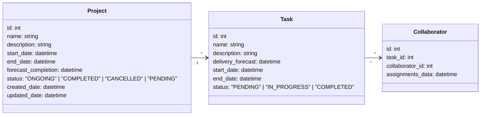

```mermaid
classDiagram
  direction LR
  class Collaborator {
    id: int
    task_id: int
    collaborator_id: int
    assignments_data: datetime
  }
  class Task {
    id: int
    name: string
    description: string
    delivery_forecast: datetime
    start_date: datetime
    end_date: datetime
    status: "PENDING" | "IN_PROGRESS" | "COMPLETED"
  }
  class Project {
    id: int
    name: string
    description: string
    start_date: datetime
    end_date: datetime
    forecast_completion: datetime
    status: "ONGOING" | "COMPLETED" | "CANCELLED" | "PENDING"
    created_date: datetime
    updated_date: datetime
  }
  Project "1"--> "*" Task
  Task "*"--> "*" Collaborator

```